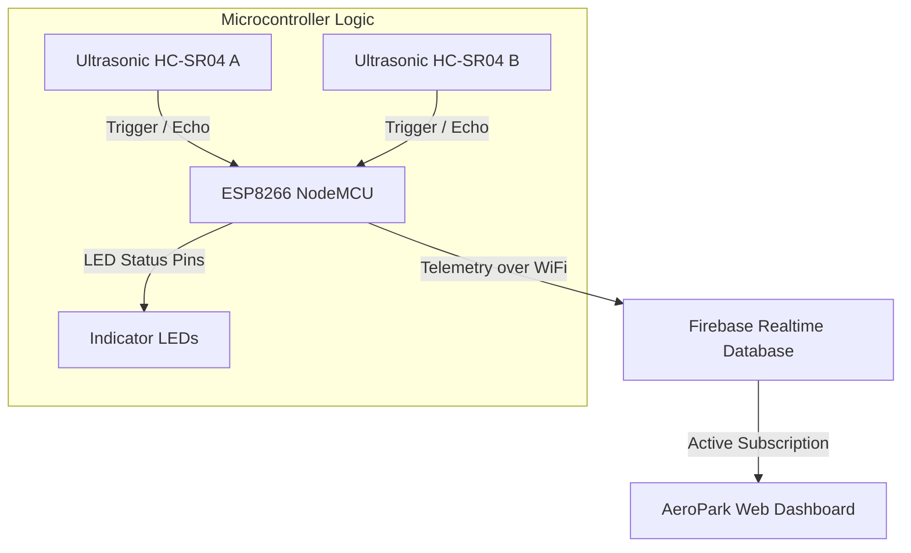

# IoT-Based Smart Parking Availability System

An advanced, real-time parking space monitoring dashboard designed for urban smart cities. The system utilizes ultrasonic sensors connected to an ESP8266 (NodeMCU) microcontroller to detect parking space availability, processes state telemetry in the cloud using Firebase Realtime Database, and visualizes slot vacancies on a modern, highly aesthetic web dashboard.

---

## 🚀 Key Features

* **Real-time Occupancy Tracking**: Dynamic visualization of **Slot 1** and **Slot 2** with top-view SVG sports cars.
* **Breathing Glow Indicators**: Visually intuitive glowing indicators (Mint Green for vacancy, Crimson Red for occupied).
* **Telemetry Insights**: Simulated hourly occupancy rates powered by Chart.js representing smart analytics.
* **Dual Theme Engine**: Seamless toggle between sleek dark mode (slate-slate gradient) and clean light mode (soft light grey).
* **Hardware Sandbox (Simulator)**: Built-in local hardware simulation panels enabling testing of slot states, range boundaries, and cloud syncs even when NodeMCU sensors are offline.
* **Native Browser Notifications**: System pushes background browser alerts as soon as occupied spots become available.

---

## 📡 System Architecture



---

## 🔌 Hardware Schematics & Pin Mapping

The web application is fully aligned with the hardware layout configured inside your Arduino sketch:

### Pinout Connections

| Hardware Component | NodeMCU Pin | GPIO Pin | Function |
| :--- | :--- | :--- | :--- |
| **Ultrasonic Sensor 1 (Slot 1)** | `D1` | `GPIO5` | TRIG (Ultrasonic trigger) |
| **Ultrasonic Sensor 1 (Slot 1)** | `D2` | `GPIO4` | ECHO (Ultrasonic receive echo) |
| **Ultrasonic Sensor 2 (Slot 2)** | `D3` | `GPIO0` | TRIG (Ultrasonic trigger) |
| **Ultrasonic Sensor 2 (Slot 2)** | `D5` | `GPIO14` | ECHO (Ultrasonic receive echo) |
| **LED Green (Slot 1)** | `D8` | `GPIO15` | Signals "Available" state (On when Vacant) |
| **LED Red (Slot 1)** | `D4` | `GPIO2` | Signals "Occupied" state (On when Occupied) |
| **LED Green (Slot 2)** | `D7` | `GPIO13` | Signals "Available" state (On when Vacant) |
| **LED Red (Slot 2)** | `D6` | `GPIO12` | Signals "Occupied" state (On when Occupied) |

---

## 🛠️ Software Stack

* **Frontend Framework**: HTML5, Vanilla ES6 Javascript (Native ES Modules), Custom CSS3 variables.
* **Database & Auth Integration**: Firebase JavaScript SDK v10 (Realtime Database & Authentication).
* **Analytics Engine**: Chart.js library via CDN.
* **Icons**: Inline SVGs for lightweight, crisp scaling.

---

## 💻 Local Testing & Setup

Since the dashboard uses modular CDN imports, there are no heavy package compilation steps:

1. Clone or download this project folder into your workspace directory.
2. In your web browser, simply open the `index.html` file or launch a local preview using a basic web server (e.g., Live Server in VS Code, or `npx serve .`).
3. Set the **Hardware Simulation Mode** to "ON" in the dashboard's Control Panel to mock sensor ranges (2cm to 30cm) and toggle spot occupancy locally.

---

## ☁️ Automating Pushing & Deployment to GitHub

We've written a custom utility `github_push.js` that bypasses local `git` software dependencies. It creates a brand-new repository `smart-parking-dashboard` under your GitHub account (`aila8055`) and turns on **GitHub Pages** hosting so your dashboard goes live.

### Prerequisites
1. Ensure you have **Node.js** installed on your system.
2. Generate a classic **GitHub Personal Access Token (classic or fine-grained)**:
   * Go to **GitHub Settings -> Developer Settings -> Personal Access Tokens**.
   * Generate a token with the `repo` scope selected.
   * Copy the token key.

### Launching the Deployment Script
1. Open your terminal inside this project folder.
2. Run the deployment setup command:
   ```bash
   node github_push.js
   ```
3. Enter your token when prompted by the script.
4. Once completed, your dashboard will be live at:
   `https://aila8055.github.io/smart-parking-dashboard/`
